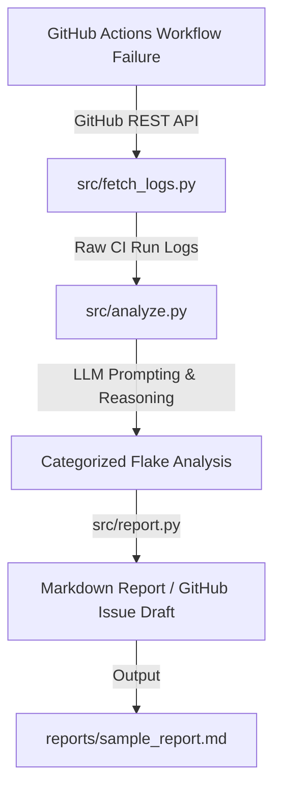

# ci-flake-agent

AI-powered CI/CD Flaky Test Analyzer and Reporter. Automatically ingest GitHub Actions workflow logs, analyze failure patterns using LLMs, categorize flake root causes, and generate structured Markdown reports or GitHub issue drafts.

## 🏗️ Architecture



## 🧠 Context-Window Handling & Smart Log Truncation

Raw CI/CD build logs frequently exceed tens of thousands of lines, consuming excessive LLM token context windows. `src/analyze.py` implements **Smart Log Truncation**:

- **Environment Context**: Retains the first ~30 lines of step execution (environment variables, dependency versions, test runner startup).
- **Error Signal Extraction**: Regex-scans full log output for failure triggers (`ERROR`, `FAIL`, `Traceback`, `Exception`, `Timeout`, `OOM`, `ConnectionRefused`). Automatically extracts a window around every detected error (5 lines before + 10 lines after).
- **Execution Tail**: Retains the last ~200 lines (final stack traces, teardown logs, exit status).
- **Compact Assembly**: Merges non-overlapping line ranges into a dense prompt payload while annotating truncated sections (`... [truncated N lines] ...`).

## 📁 Repository Structure

```text
ci-flake-agent/
├── .github/workflows/flaky-demo.yml   # Generates realistic flaky test failure samples
├── src/
│   ├── fetch_logs.py                  # GitHub API log ingestion & flake detector
│   ├── analyze.py                     # LLM failure categorization & smart log truncation
│   ├── flaky_runner.py                # Flaky test suite simulator (4 failure modes)
│   └── report.py                      # Markdown report & issue draft generator
├── reports/                           # Generated sample reports & batch JSON analysis
├── logs/                              # Ingested & cleaned CI run logs
├── requirements.txt                   # Python dependencies
└── README.md                          # Architecture & documentation
```

## 🚀 Quick Start

### 1. Installation

```bash
git clone https://github.com/RK0297/ci-flake-agent.git
cd ci-flake-agent
pip install -r requirements.txt
```

### 2. Usage Workflow

#### Step 1: Fetch Logs & Detect Flaky Runs
```bash
python src/fetch_logs.py --repo RK0297/ci-flake-agent --detect-flaky --download-failed --output-dir logs
```

#### Step 2: Analyze Logs with LLM (or Local Ollama / Heuristic Fallback)
```bash
python src/analyze.py --input logs --output reports
```

#### Step 3: Generate Flake Report / GitHub Issue Draft
```bash
python src/report.py --input reports/batch_analysis.json --output reports/sample_report.md
```

## 📄 Output Schema (`src/analyze.py`)

Produces strict JSON categorized into `race_condition`, `network_timeout`, `infra_failure`, or `real_bug`:

```json
{
  "category": "race_condition",
  "confidence": 0.89,
  "explanation": "Non-deterministic state mismatch detected across concurrent worker threads.",
  "suggested_mitigation": "Isolate shared state variables, use mutex locks, or execute test suite with atomic fixtures."
}
```

## 📄 License

MIT
