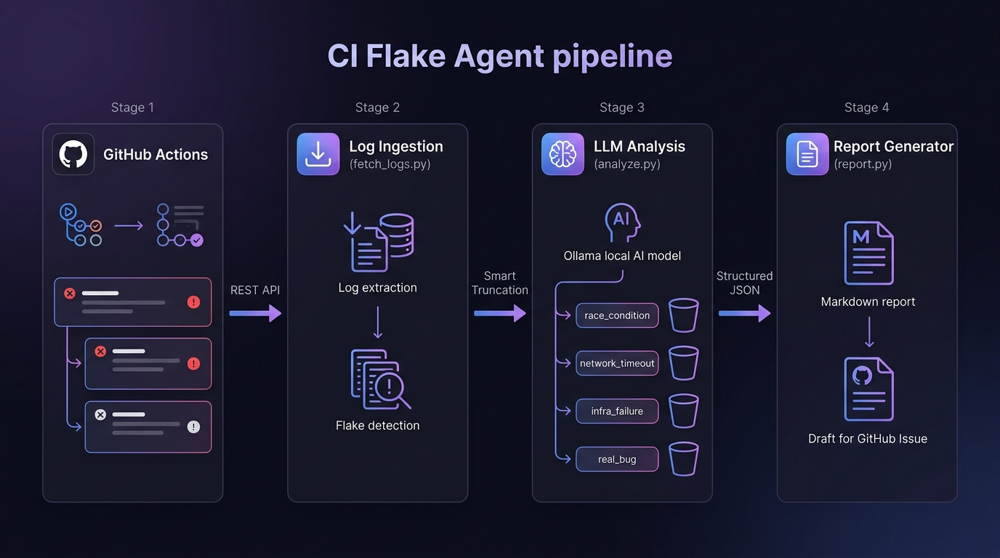
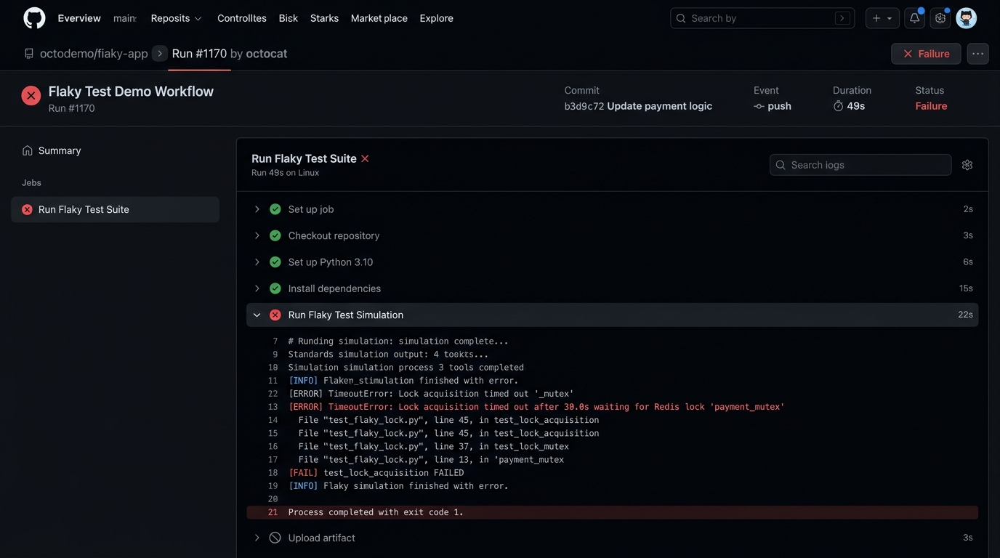
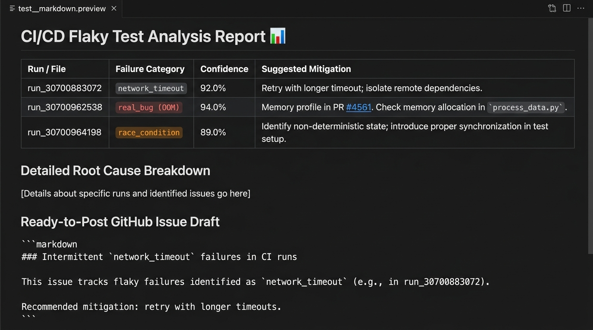

# 🔍 ci-flake-agent

> **AI-powered CI/CD Flaky Test Analyzer.** Automatically ingest GitHub Actions workflow logs, detect non-deterministic failures, analyze root causes using Local AI (Ollama) or heuristic engines, and generate structured Markdown reports with ready-to-post GitHub Issue drafts.

[](https://github.com/RK0297/ci-flake-agent/actions/workflows/flaky-demo.yml)

---

## 🏗️ Architecture

<p align="center">
  
</p>

```
┌─────────────────┐     ┌──────────────────┐     ┌──────────────────┐     ┌──────────────────┐
│  GitHub Actions  │────▶│  Log Ingestion   │────▶│   LLM Analysis   │────▶│ Report Generator │
│  Workflow Runs   │     │  fetch_logs.py   │     │   analyze.py     │     │   report.py      │
│                  │     │                  │     │                  │     │                  │
│ • Failed runs    │ API │ • Download zips  │     │ • Smart truncate │     │ • Markdown table │
│ • Retry data     │────▶│ • Strip noise    │────▶│ • Ollama / LLM   │────▶│ • Issue draft    │
│ • Commit SHAs    │     │ • Flake detect   │     │ • Strict JSON    │     │ • API posting    │
└─────────────────┘     └──────────────────┘     └──────────────────┘     └──────────────────┘
```

### Pipeline Flow

| Stage | Module | Description |
|:------|:-------|:------------|
| **1. Ingestion** | `src/fetch_logs.py` | Calls GitHub REST API to list failed runs, download log archives, extract failing step text, strip timestamps/ANSI noise, and detect flaky commits (same SHA with both pass + fail) |
| **2. Analysis** | `src/analyze.py` | Smart-truncates logs for LLM context windows, queries local Ollama AI (or heuristic fallback), outputs strict JSON with category, confidence, explanation, and mitigation |
| **3. Reporting** | `src/report.py` | Generates Markdown flake report with summary table, detailed root cause breakdown, and ready-to-paste GitHub Issue draft. Optional `--post` flag to auto-comment on issues via API |

---

## 📸 Screenshots

### Failed GitHub Actions Run → Generated Flake Report

<p align="center">
  
  &nbsp;&nbsp;
  
</p>

<p align="center"><em>Left: A flaky test failure in GitHub Actions &nbsp;|&nbsp; Right: Auto-generated analysis report with category, confidence, and mitigation</em></p>

---

## 📁 Repository Structure

```text
ci-flake-agent/
├── .github/workflows/flaky-demo.yml   # Generates realistic flaky test failures (4 failure modes)
├── src/
│   ├── fetch_logs.py                  # GitHub API log ingestion & flake detector
│   ├── analyze.py                     # LLM failure categorization & smart log truncation
│   ├── flaky_runner.py                # Flaky test suite simulator (timeout, network, race, OOM)
│   └── report.py                      # Markdown report & issue draft generator
├── reports/                           # Generated sample reports & batch JSON analysis
│   ├── sample_report.md               # Full batch report (ci-flake-agent's own runs)
│   ├── podman_flake_report.md         # Real-world containers/podman analysis
│   └── *.json                         # Per-run analysis JSON outputs
├── logs/                              # Ingested & cleaned CI run logs
│   ├── podman/                        # Real-world containers/podman failure logs
│   └── *.txt                          # Extracted step logs from ci-flake-agent runs
├── assets/                            # README images & diagrams
├── requirements.txt                   # Python dependencies
└── README.md                          # This file
```

---

## 🚀 Quick Start

### 1. Installation

```bash
git clone https://github.com/RK0297/ci-flake-agent.git
cd ci-flake-agent
pip install -r requirements.txt
```

### 2. (Optional) Local AI with Ollama

For local LLM analysis (no API keys needed):

```bash
# Install Ollama: https://ollama.com/download
ollama pull gemma3:1b        # or any model you prefer
ollama serve                 # starts on http://localhost:11434
```

### 3. Run the Pipeline

```bash
# Step 1: Fetch failed run logs & detect flaky commits
python src/fetch_logs.py --repo owner/repo --detect-flaky --download-failed --output-dir logs

# Step 2: Analyze logs with LLM (auto-detects Ollama, falls back to heuristics)
python src/analyze.py --input logs --output reports

# Step 3: Generate Markdown report & GitHub issue draft
python src/report.py --input reports/batch_analysis.json --output reports/flake_report.md

# (Bonus) Auto-post report as a comment on a GitHub issue
python src/report.py --input reports/batch_analysis.json --output reports/flake_report.md \
  --post --repo owner/repo --issue-id 42
```

---

## 📄 Output Schema

`src/analyze.py` produces strict JSON with exactly one of four categories:

```json
{
  "category": "race_condition | network_timeout | infra_failure | real_bug",
  "confidence": 0.92,
  "explanation": "Operation timed out waiting for lock release or network response within threshold.",
  "suggested_mitigation": "Increase async timeout threshold or implement exponential backoff retry policy."
}
```

| Category | Description | Typical Signals |
|:---------|:------------|:----------------|
| `race_condition` | Non-deterministic shared state / concurrency bug | `AssertionError`, `Expected X got Y`, thread contention |
| `network_timeout` | Async operation or network call exceeded timeout | `TimeoutError`, `timed out`, lock acquisition failure |
| `infra_failure` | External service / infrastructure unavailable | `ConnectionError`, `Connection refused`, DNS failure |
| `real_bug` | Deterministic bug or resource exhaustion | `MemoryError`, `OOM`, `exit code 137`, unhandled exception |

---

## 🧠 Context-Window Handling & Smart Log Truncation

Raw CI/CD build logs can be tens of thousands of lines long. Feeding them directly to an LLM wastes context tokens on noise. `src/analyze.py` implements **Smart Log Truncation** to maximize signal density:

```
┌─────────────────────────────────────────────────────┐
│ HEAD (~30 lines)                                    │  ← Environment setup, runner config
│   pythonLocation: /opt/hostedtoolcache/Python/3.11  │
│   LD_LIBRARY_PATH: ...                              │
├─────────────────────────────────────────────────────┤
│ ... [truncated 2,847 lines of normal output] ...    │  ← Build output, test passes (skipped)
├─────────────────────────────────────────────────────┤
│ ERROR CONTEXT (5 before + 10 after each error)      │  ← Every line matching error keywords
│   [ERROR] TimeoutError: Lock acquisition timed out  │     gets its surrounding context preserved
│   Traceback (most recent call last):                │
│     File "tests/test_payment.py", line 54           │
├─────────────────────────────────────────────────────┤
│ TAIL (~200 lines)                                   │  ← Final stack traces, exit codes,
│   ##[error]Process completed with exit code 1.      │     teardown logs
└─────────────────────────────────────────────────────┘
```

This approach:
- Preserves **environment context** (first ~30 lines) for runner/dependency version info
- Extracts **error signal windows** (regex-detected `ERROR|FAIL|Traceback|Exception|Timeout|OOM`)
- Retains the **execution tail** (last ~200 lines) where final failures and exit codes live
- Merges overlapping ranges and annotates gaps with `... [truncated N lines] ...`

---

## 🎛️ How to Tweak the Prompts

The LLM categorization prompt is the core of the analysis engine. You can customize it to match your project's failure taxonomy, coding standards, or domain-specific error patterns.

### Prompt Location

The main prompt lives in [`src/analyze.py`](src/analyze.py) inside the `call_ollama()` function:

```python
prompt = f"""You are a CI/CD Reliability Engineer analyzing a flaky build log.
Categorize the failure into EXACTLY ONE of these categories:
- race_condition
- network_timeout
- infra_failure
- real_bug

Respond strictly in valid JSON format:
{{
  "category": "race_condition|network_timeout|infra_failure|real_bug",
  "confidence": 0.95,
  "explanation": "<2-3 sentence root cause breakdown>",
  "suggested_mitigation": "<Actionable fix recommendation>"
}}

Log Content:
{log_snippet}
"""
```

### Customization Guide

#### 1. Add Custom Categories

Extend the `VALID_CATEGORIES` list and prompt to match your project's failure patterns:

```python
# In analyze.py, update the constant:
VALID_CATEGORIES = [
    "race_condition", "network_timeout", "infra_failure", "real_bug",
    "flaky_dependency",   # e.g., npm registry intermittent 503s
    "resource_leak",      # e.g., file descriptor / memory leak over time
    "platform_specific",  # e.g., fails only on Windows ARM64
]
```

Then add matching entries to the prompt's category list and to the `rule_based_analysis()` heuristic fallback.

#### 2. Change the Persona / Role

The system prompt sets the LLM's expertise level. Adjust it for your domain:

```python
# Default (generic CI/CD):
"You are a CI/CD Reliability Engineer analyzing a flaky build log."

# For a Kubernetes-focused project:
"You are a Kubernetes Platform Engineer analyzing container orchestration CI failures."

# For a frontend project:
"You are a Frontend QA Engineer analyzing browser test flakiness in Playwright/Cypress logs."
```

#### 3. Tune Confidence Thresholds

The heuristic fallback in `rule_based_analysis()` assigns static confidence scores. Adjust these based on how reliable each signal keyword is for your codebase:

```python
# Higher confidence for very specific error signatures:
if "deadlock detected" in log_lower:
    category = "race_condition"
    confidence = 0.98  # very specific signal

# Lower confidence for ambiguous signals:
if "error" in log_lower:
    category = "real_bug"
    confidence = 0.60  # too generic to be certain
```

#### 4. Adjust Smart Truncation Window

In `smart_truncate_log()`, tune the context window sizes:

```python
def smart_truncate_log(log_text, head_lines=30, tail_lines=200):
    # head_lines: how many initial lines to keep (environment setup)
    # tail_lines: how many final lines to keep (exit codes, stack traces)
    # Error context: 5 lines before + 10 lines after each error signal
```

For very verbose test runners (e.g., Jest with `--verbose`), increase `tail_lines` to 400.  
For terse runners (e.g., Go `testing`), reduce `head_lines` to 10.

#### 5. Switch LLM Provider

The `--provider` flag controls which engine runs the analysis:

```bash
# Auto-detect (tries Ollama first, falls back to heuristics):
python src/analyze.py --input logs --provider auto

# Force local Ollama only:
python src/analyze.py --input logs --provider ollama

# Force heuristic-only (no LLM, instant results):
python src/analyze.py --input logs --provider heuristic
```

---

## ⚡ Flake Detection Logic

The `detect_flaky_runs()` function in `fetch_logs.py` identifies non-deterministic failures:

```python
# A commit is FLAKY if:
# 1. Same (workflow_id, commit_sha) has BOTH "success" AND "failure" conclusions
# 2. OR any run attempt > 1 (GitHub's built-in retry succeeded)
has_pass_and_fail = ("success" in conclusions) and ("failure" in conclusions)
has_retry = any(attempt > 1 for attempt in attempts)
```

This is the key insight: **if the same code passes and fails on the same commit, the failure is non-deterministic** — i.e., a flake, not a real bug.

---

## 🧪 Flaky Test Demo Workflow

The included `.github/workflows/flaky-demo.yml` runs [`src/flaky_runner.py`](src/flaky_runner.py), which simulates 4 realistic failure modes with a 40% failure probability:

| Failure Mode | Error Signal | Category |
|:-------------|:-------------|:---------|
| Redis lock timeout | `TimeoutError: Lock acquisition timed out after 30.0s` | `network_timeout` |
| Payment API connection refused | `ConnectionError: HTTPSConnectionPool... Connection refused` | `infra_failure` |
| Concurrent balance race condition | `AssertionError: Expected balance 100, found 97` | `race_condition` |
| Large batch OOM | `MemoryError: Unable to allocate 4.12 GiB` / exit code 137 | `real_bug` |

---

## 🌍 Tested on Real-World Data

This tool has been validated against real CI failures from:

- **[`containers/podman`](https://github.com/containers/podman)** — Analyzed `windows machine hyperv` timeout failures and `machine linux amd64` infra failures from their CI pipeline. Sample reports are committed in [`reports/`](reports/).

---

## 📄 License

MIT
