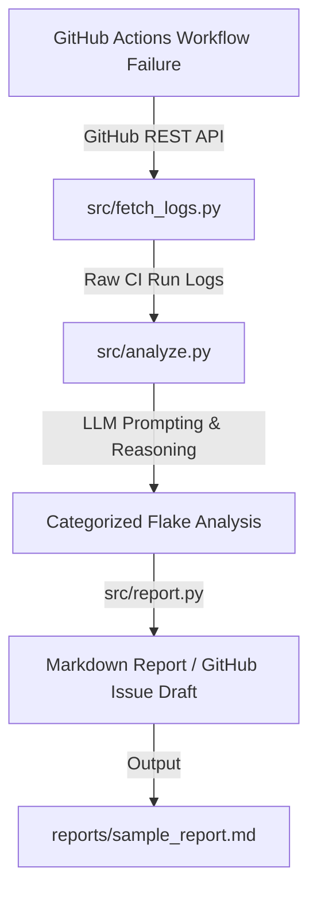

# ci-flake-agent

AI-powered CI/CD Flaky Test Analyzer and Reporter. Automatically ingest GitHub Actions workflow logs, analyze failure patterns using LLMs, categorize flake root causes, and generate structured Markdown reports or GitHub issue drafts.

## 🏗️ Architecture



## 📁 Repository Structure

```text
ci-flake-agent/
├── .github/workflows/flaky-demo.yml   # Generates realistic flaky test failure samples
├── src/
│   ├── fetch_logs.py                  # GitHub API log ingestion module
│   ├── analyze.py                     # LLM failure categorization module
│   └── report.py                      # Markdown report & issue draft generator
├── reports/                           # Generated sample reports & outputs
├── requirements.txt                   # Python dependencies
└── README.md                          # Project overview & documentation
```

## 🚀 Quick Start

### 1. Installation

```bash
git clone https://github.com/RK0297/ci-flake-agent.git
cd ci-flake-agent
pip install -r requirements.txt
```

### 2. Environment Configuration

Set your environment variables in `.env` or your environment:

```bash
export GITHUB_TOKEN="your_github_token"
export GEMINI_API_KEY="your_gemini_api_key"  # or OPENAI_API_KEY
```

### 3. Usage

#### Step 1: Fetch Logs from GitHub Workflow Run
```bash
python src/fetch_logs.py --repo owner/repo --run-id 12345678 --output logs.txt
```

#### Step 2: Analyze Logs with LLM
```bash
python src/analyze.py --input logs.txt --output analysis.json
```

#### Step 3: Generate Flake Report
```bash
python src/report.py --input analysis.json --output reports/sample_report.md
```

## 🧪 Flaky Test Demo Workflow

The included `.github/workflows/flaky-demo.yml` runs a simulated test suite with non-deterministic race conditions and network timeout simulations to demonstrate automated log ingestion and flake detection.

## 📄 License

MIT
